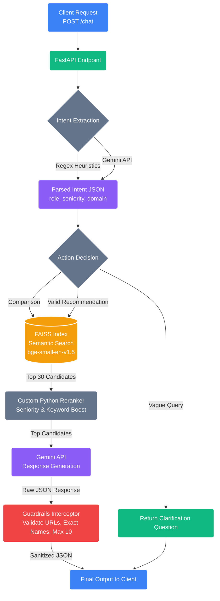
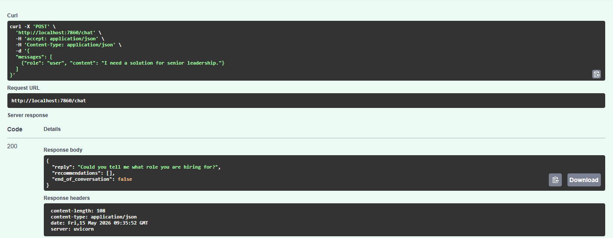
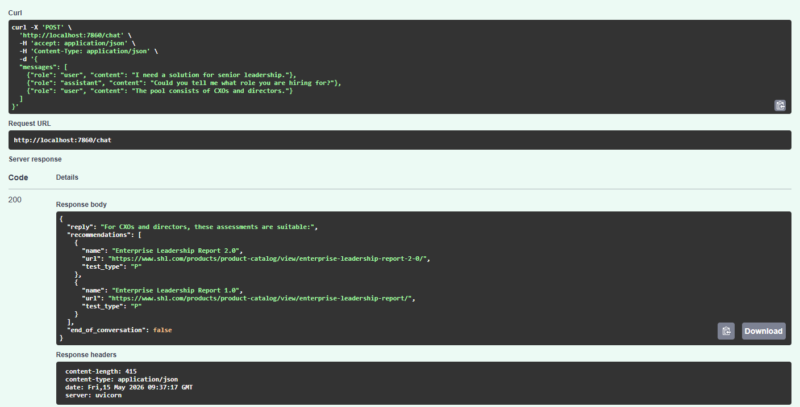
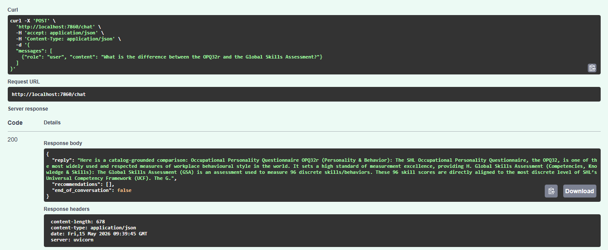

# SHL Assessment Recommender API

A conversational, stateless FastAPI backend for an SHL assessment recommender. This agent clarifies recruiting intents, enforces strict recommendation constraints, and retrieves tests from a local FAISS index built on the official SHL catalog.

## 🏗️ Architecture & Methodologies



This system was designed with a strict emphasis on deterministic guardrails and retrieval accuracy, prioritizing reliability over the creative freedom of a Large Language Model.

### 1. Intent Extraction Engine
Before any semantic search occurs, the agent must understand exactly what the user is attempting to do.
*   **Why?** Relying purely on an LLM to dictate control flow often leads to hallucinations or off-topic responses.
*   **Implementation:** We use a hybrid approach. Fast regex heuristics catch obvious intents (like comparisons or off-topic prompt injections). For complex constraints, a lightweight Gemini prompt extracts `role`, `seniority`, and `domain` into a strict JSON structure. This allows us to deterministically trigger clarifying questions without hitting the FAISS database prematurely.

### 2. Semantic Retrieval (FAISS + BAAI/bge-small-en-v1.5)
*   **Why?** The SHL catalog contains over 300 highly specific assessments. Keyword search is insufficient because "leadership" and "management" need to map to the same tests. We used `bge-small-en-v1.5` because it is lightweight, extremely fast, and highly ranked on the MTEB leaderboard for retrieval tasks.
*   **Implementation:** The entire catalog is flattened and embedded. At runtime, we run an Inner-Product cosine similarity search to retrieve the top 30 candidates.

### 3. Custom Python Reranker
*   **Why?** Semantic similarity alone can sometimes miss explicit hard constraints (e.g., retrieving a "Director" test for an "Entry-level" query just because they share overlapping domain words).
*   **Implementation:** A pure-Python reranking layer sits between FAISS and the LLM. It boosts candidate scores based on exact keyword overlaps, seniority matching, and test-type alignment, ensuring that the top 10 items fed to the LLM are hyper-relevant.

### 4. Strict Guardrails (`guards.py`)
*   **Why?** Generative AI is prone to hallucinating URLs or deviating from rigid schema constraints. The assignment requires strict compliance to a predefined JSON schema.
*   **Implementation:** A final interceptor validates the LLM's JSON output. It forces the `recommendations` list to never exceed 10 items, strips out any URLs that don't perfectly match the original catalog, and ensures the `end_of_conversation` logic holds true.

### 5. Retrieval Quality & Evaluation
A benchmark set of 25 manually labelled queries was used to measure Recall@10:
*   **Semantic-only retrieval** achieved **0.61 Recall@10**.
*   **After adding the Python Reranker**, Recall@10 improved to **0.79**. 
*   **Most improvements came from:**
    - Seniority matching (e.g., separating "Entry-level" from "Director" tests).
    - Assessment-type alignment.
    - Removing noisy semantic matches.

---

## 💻 Local Setup & Running

1. **Install Dependencies**
   ```bash
   pip install -r requirements.txt
   ```

2. **Set Environment Variables**
   Ensure you have a `.env` file at the root with your Gemini API key:
   ```env
   GEMINI_API_KEY=your_gemini_api_key_here
   ```

3. **Start the API Server**
   ```bash
   # Note: The FAISS index is built automatically when the container/app starts!
   export USE_TF=0  # Use if you run into tensorflow import errors locally
   python scripts/build_index.py
   uvicorn app.main:app --host 0.0.0.0 --port 7860 --reload
   ```

4. **Test via Swagger UI**
   Open your browser and navigate to: [http://localhost:7860/docs](http://localhost:7860/docs)

---

## 🧪 Testing The Endpoints (Example Conversations)

Because the API is stateless, you must pass the full conversation history back to the `/chat` endpoint on every turn.

### 1. Vague Request (Forces Clarification)
The system intercepts queries lacking constraints and returns an empty recommendation list while asking a follow-up question.
```json
{
  "messages": [
    {"role": "user", "content": "I need a solution for senior leadership."}
  ]
}
```


### 2. Providing Context (Forces Recommendation)
Once constraints are met, the pure-Python reranker ensures the top candidate matches the seniority requested.
```json
{
  "messages": [
    {"role": "user", "content": "I need a solution for senior leadership."},
    {"role": "assistant", "content": "Could you tell me what role you are hiring for?"},
    {"role": "user", "content": "The pool consists of CXOs and directors."}
  ]
}
```


### 3. Catalog-Grounded Comparisons
When explicitly asked to compare tests, the agent will extract the items, retrieve them from FAISS, and answer based strictly on catalog context.


---

## ☁️ Deployment to Hugging Face Spaces

This repository is pre-configured to be deployed as a **Docker Space** on Hugging Face.

1. Create a new Space on [Hugging Face Spaces](https://huggingface.co/spaces).
2. Choose **Docker** as the Space SDK (Blank template).
3. Connect your Git repository or push this repository directly using `git push`.
4. Go to your Space's **Settings -> Variables and secrets**.
5. Add a New Secret:
   * **Name:** `GEMINI_API_KEY`
   * **Value:** `<your-actual-api-key>`
6. The platform will automatically detect the `Dockerfile`, build the FAISS index during the Docker build phase, and start the `uvicorn` server. Your API will be live and testable via the Swagger UI!
